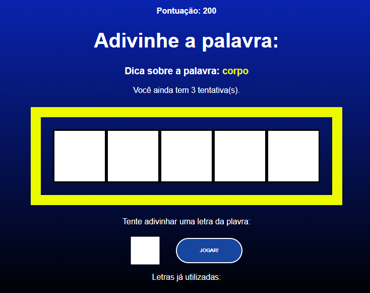

# Secret Word
Esse jogo é de adivinhar palavras, onde você fala uma letra e se a mesma estiver correta vai formando uma plavra.

## 🔥 Introdução
O objetivo desse jogo é adivinhar palavras relacionadas a um determinado tema, onde você inicia com 200 pontos
e tem uma dica da palavra que você precisa adivinhar.

### ⚙️ Pré-requisitos
Não tém pré requisitos, é só baixar o repositorio, descompactar e no terminal da um yarn dev
porem vou deixar o link do jogo, e é só voce jogar.

### 🔨 Guia de instalação
Não precisa instalar nada.

### 🛠️ Testes
Fiz varios testes

### 👨‍💻 Tecnologias usadas
 - React.js
 - CSS3
 - JavaScript
 - Nodejs
 - Yarn

 **Backend:**
 - JSON 
> Simulando uma API

### 🙋 Autores / Colaboradores
* **Matheus Batist** - *Mentor do projeto* - [nome_dev](link.git)
* **jailson dev** - *FrontEnd do projeto* - [@jailson_ofcial](www.google.com)

### 🔗 Licença
Esse projeto está sob a licença (livre) - acesse os detatlhes [LICENSE.md](www.google.com).

### 🫂 Gratidão agradecimentos
- Obrigado por acompanha o meu projeto até aqui.
- Email de contato para: __jailson.nogueira2@gmail.com__
- WhatsApp: __159 8819-6147__
- LinkeDin: [meu_linkedin](https://www.linkedin.com/in/jailsonn-silva/)
